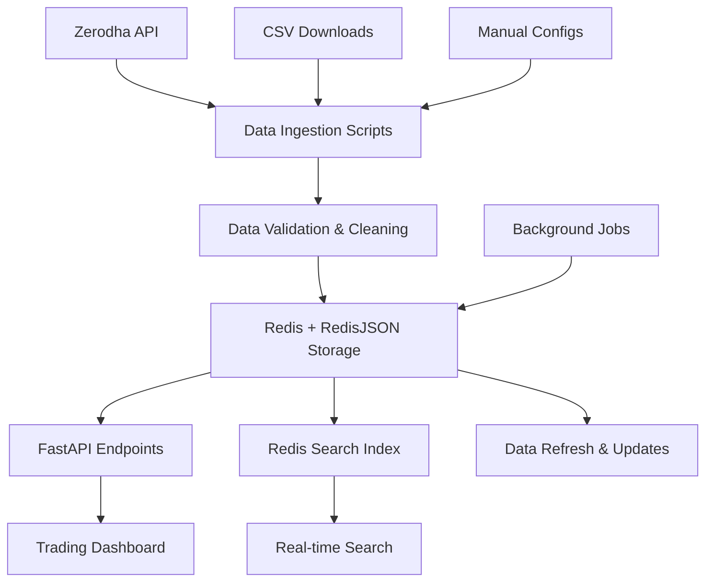

# 🏗️ Backend Data Storage Strategy for Trading Dashboard

## 📊 **Current Data Architecture Analysis**

### **Existing Data Sources:**
- ✅ **`token_lookup_enriched.json`** (3.9M lines) - Rich metadata from Zerodha API
- ✅ **`binary_crawler1.json`** - 246 active trading instruments
- ✅ **Multiple CSV files** - Downloaded from various exchanges
- ✅ **Hardcoded lists** - Scattered across config files

### **Problems with Current Approach:**
- ❌ **Data Fragmentation** - Multiple sources, no single source of truth
- ❌ **No Real-time Updates** - Static JSON files
- ❌ **Performance Issues** - Large JSON files loaded on every request
- ❌ **No Search Capability** - Linear search through large datasets
- ❌ **Memory Intensive** - Loading entire datasets into memory

---

## 🚀 **Recommended Production Architecture**

### **1. Primary Storage: Redis + RedisJSON + RediSearch**

```python
# Data Structure in Redis
{
  "instruments:master": {           # Complete dataset
    "token_id": {
      "symbol": "NSE:RELIANCE",
      "name": "RELIANCE",
      "exchange": "NSE",
      "sector": "Energy",
      "expiry": "2025-11-25",
      "strike_price": null,
      "option_type": "",
      "lot_size": 1,
      "tick_size": 0.05
    }
  },
  "instruments:equity_cash": [...],     # Pre-categorized for fast access
  "instruments:equity_futures": [...],
  "instruments:index_futures": [...],
  "instruments:index_options": [...],
  "instruments:metadata": {             # Statistics and metadata
    "total_instruments": 50000,
    "last_updated": "2025-10-30T16:00:00Z",
    "categories": {
      "equity_cash": 3000,
      "equity_futures": 2000,
      "index_futures": 100,
      "index_options": 10000
    }
  }
}
```

### **2. Data Flow Architecture**



### **3. Performance Optimizations**

#### **A. Caching Strategy**
- **L1 Cache**: In-memory Redis (sub-millisecond access)
- **L2 Cache**: RedisJSON with TTL (1 hour)
- **L3 Cache**: Pre-categorized asset classes

#### **B. Search Optimization**
- **RediSearch Indexes**: Full-text search on symbols, names, sectors
- **Tag Fields**: Fast filtering by exchange, asset class
- **Numeric Fields**: Range queries on strike prices, expiry dates

#### **C. Data Partitioning**
- **By Asset Class**: Separate Redis keys for each category
- **By Exchange**: NSE, NFO, BFO partitions
- **By Time**: Current vs expired instruments

---

## 🔧 **Implementation Details**

### **1. Data Manager (`instrument_data_manager.py`)**
```python
class InstrumentDataManager:
    async def get_instruments_by_asset_class(self, asset_class: str) -> List[Dict]
    async def search_instruments(self, query: str) -> List[Dict]
    async def get_instrument_metadata(self) -> Dict
    async def refresh_data(self) -> None
```

### **2. API Endpoints**
```python
GET /api/instruments/{asset_class}     # Get by category
GET /api/instruments/search/{query}    # Search instruments
GET /api/instruments/metadata          # Statistics
POST /api/instruments/refresh          # Refresh data
```

### **3. Data Refresh Strategy**
- **Real-time**: WebSocket updates for active instruments
- **Scheduled**: Daily refresh from Zerodha API
- **Event-driven**: New instrument additions
- **Manual**: Admin-triggered refresh

---

## 📈 **Scalability & Performance**

### **Expected Performance:**
- **Instrument Lookup**: < 1ms (Redis)
- **Search Queries**: < 10ms (RediSearch)
- **Dashboard Load**: < 100ms (cached data)
- **Memory Usage**: ~500MB for 50K instruments

### **Scaling Options:**
- **Horizontal**: Redis Cluster for multiple nodes
- **Vertical**: More memory for larger datasets
- **Hybrid**: Redis + PostgreSQL for complex queries

---

## 🔄 **Data Update Workflow**

### **1. Initial Setup**
```bash
# Initialize data from existing sources
python alerts/init_instrument_data.py
```

### **2. Daily Refresh**
```bash
# Update from Zerodha API
python crawlers/crawler_helpers/update_all_tokens.py
python alerts/init_instrument_data.py
```

### **3. Real-time Updates**
- WebSocket connections for live data
- Redis Streams for instrument changes
- Automatic cache invalidation

---

## 🛡️ **Data Quality & Validation**

### **Validation Rules:**
- ✅ **Symbol Format**: Valid exchange prefixes (NSE:, NFO:, BFO:)
- ✅ **Expiry Dates**: Valid future dates for F&O
- ✅ **Strike Prices**: Valid numeric ranges for options
- ✅ **Token Uniqueness**: No duplicate tokens across exchanges

### **Error Handling:**
- **Graceful Degradation**: Fallback to static data
- **Data Validation**: Schema validation before storage
- **Monitoring**: Alerts for data quality issues

---

## 💡 **Benefits of This Approach**

### **✅ Performance**
- **Sub-millisecond** instrument lookups
- **Real-time search** capabilities
- **Efficient memory usage**

### **✅ Scalability**
- **Horizontal scaling** with Redis Cluster
- **Caching layers** for different access patterns
- **Background processing** for data updates

### **✅ Developer Experience**
- **Simple API** for frontend consumption
- **Type-safe** data structures
- **Comprehensive logging** and monitoring

### **✅ Production Ready**
- **High availability** with Redis replication
- **Data persistence** with Redis AOF
- **Monitoring** with Redis metrics

---

## 🚀 **Next Steps**

1. **Initialize Data**: Run `python alerts/init_instrument_data.py`
2. **Test Endpoints**: Verify API responses
3. **Update Dashboard**: Use new data sources
4. **Monitor Performance**: Track response times
5. **Scale as Needed**: Add Redis Cluster if required

This architecture provides a robust, scalable foundation for the trading dashboard's instrument data needs! 🎯
