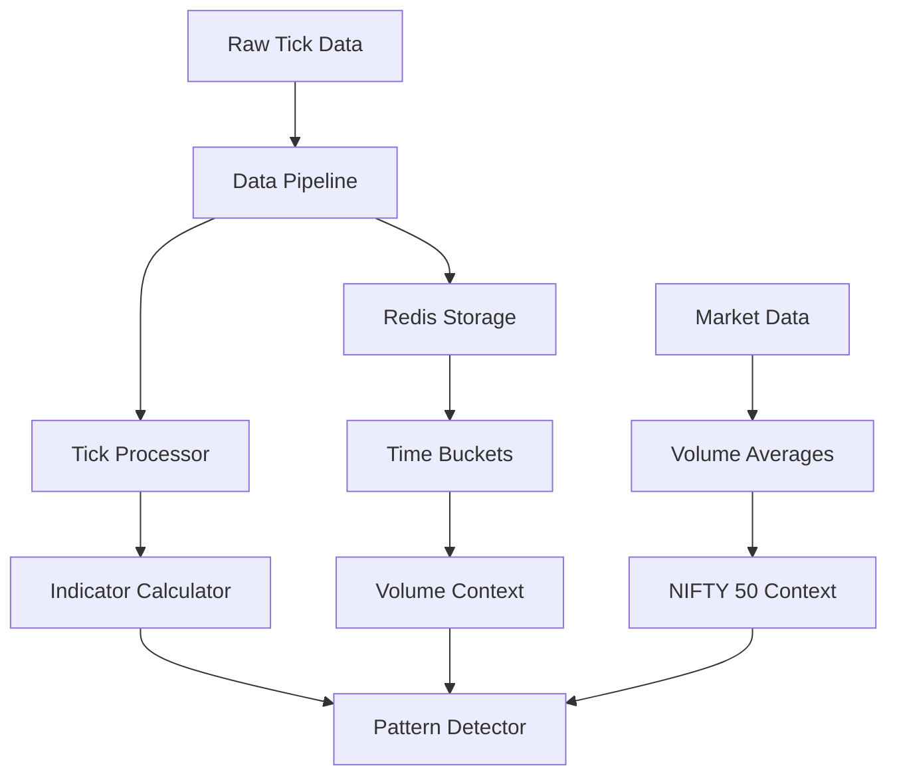
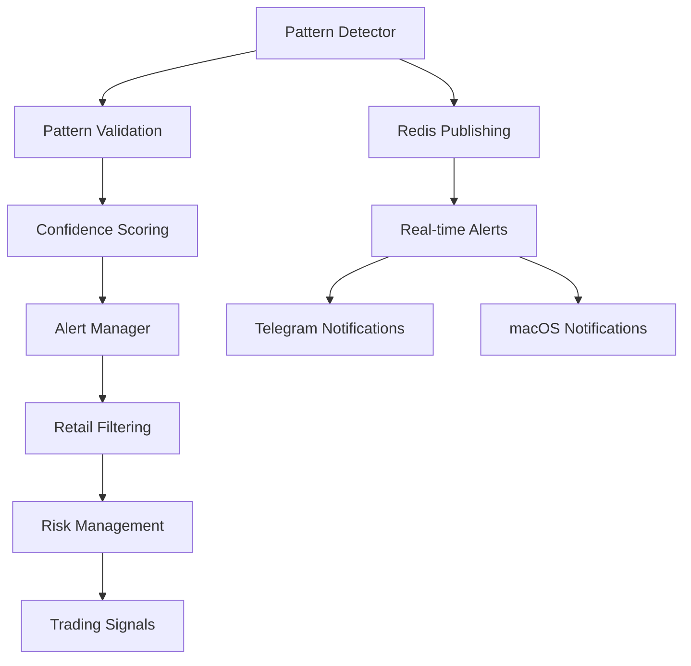

# Advanced Patterns Analysis & Integration

## 🎯 **ADVANCED PATTERNS OVERVIEW**

The trading system implements **24+ advanced pattern types** across multiple categories, each with sophisticated detection algorithms and upstream/downstream integration.

## 📊 **PATTERN CATEGORIES & TYPES**

### 1. **VOLUME PATTERNS** (4 types)
- **`volume_spike`** - Extreme volume events (>5x normal)
- **`volume_accumulation`** - Gradual volume buildup
- **`volume_dump`** - Sudden volume selloff
- **`volume_breakout`** - High volume price breakout

### 2. **PRESSURE PATTERNS** (2 types)
- **`buy_pressure`** - Order book buy-side dominance
- **`sell_pressure`** - Order book sell-side dominance

### 3. **MOMENTUM PATTERNS** (2 types)
- **`bullish_momentum`** - Upward price momentum
- **`bearish_momentum`** - Downward price momentum

### 4. **VOLATILITY PATTERNS** (1 type)
- **`high_volatility`** - Elevated price volatility

### 5. **TOXICITY PATTERNS** (1 type)
- **`vpin_toxicity`** - Volume-synchronized price impact

### 6. **MARKET MICROSTRUCTURE PATTERNS** (8 types)
- **`market_maker`** - Market making activity detection
- **`ping_pong`** - Rapid bid-ask flipping
- **`scalping_opportunity`** - High-frequency trading opportunities
- **`spread_arbitrage`** - Spread-based arbitrage opportunities
- **`volume_exhaustion`** - Volume exhaustion signals
- **`buy_imbalance`** - Order book buy imbalance
- **`sell_imbalance`** - Order book sell imbalance
- **`volume_burst`** - Sudden volume bursts

### 7. **BREAKOUT PATTERNS** (2 types)
- **`breakout`** - Price breakout with volume confirmation
- **`momentum_breakout`** - High volume + significant price change

### 8. **REVERSAL PATTERNS** (1 type)
- **`reversal`** - Volume-price divergence reversal signals

### 9. **DEEPSEEK ADVANCED PATTERNS** (4 types)
- **`psu_dump`** - PSU stock dumping pattern
- **`spring_coil`** - Spring coil compression pattern
- **`volume_price_divergence`** - Volume-price divergence analysis
- **`volume_price_divergence_fallback`** - Fallback divergence detection

### 10. **CROSS-CORRELATION PATTERNS** (2 types)
- **`cross_correlation`** - Inter-symbol correlation analysis
- **`coordinated_manipulation`** - Coordinated manipulation detection

### 11. **CLUSTERING PATTERNS** (1 type)
- **`dbscan_cluster`** - DBSCAN-based pattern clustering

### 12. **FALSE BREAKOUT PATTERNS** (1 type)
- **`false_breakout`** - Pre-market manipulation false breakout detection

## 🔄 **UPSTREAM INTEGRATION**

### **Data Sources → Pattern Detection**



### **Key Upstream Dependencies:**

1. **Volume Context Enhancement**
   ```python
   def _ensure_volume_context(self, indicators):
       # Adds volume_ratio, intraday_volume_ratio
       # Integrates NIFTY 50 market context
       # Provides fallback calculations
   ```

2. **Indicator Calculations**
   ```python
   def _calculate_all_indicators(self, symbol, tick_data):
       # Calculates 20+ technical indicators
       # Provides volume ratios, momentum, volatility
       # Integrates market microstructure data
   ```

3. **Time-Based Context**
   ```python
   def get_time_based_thresholds(self, current_time):
       # Adjusts pattern thresholds by time of day
       # Provides market regime context
   ```

## 🔄 **DOWNSTREAM INTEGRATION**

### **Pattern Detection → Trading Actions**



### **Key Downstream Integrations:**

1. **Alert Generation**
   ```python
   def process_crawler_alert(self, alert_data):
       # Converts patterns to actionable alerts
       # Applies retail price filtering (₹18-₹5000)
       # Implements cooldown periods
   ```

2. **Risk Management**
   ```python
   def validate_signal(self, signal):
       # Validates pattern confidence
       # Checks position sizing
       # Applies risk limits
   ```

3. **Real-time Publishing**
   ```python
   def publish_to_redis(self, channel, data):
       # Publishes patterns to Redis channels
       # Enables real-time monitoring
       # Supports multiple subscribers
   ```

## 🧠 **ADVANCED DETECTION ALGORITHMS**

### **1. DBSCAN Clustering**
```python
def _detect_dbscan_patterns(self, indicators_list):
    # Groups similar patterns across symbols
    # Detects coordinated market movements
    # Identifies sector-wide patterns
```

### **2. Cross-Correlation Analysis**
```python
def _detect_cross_correlation_patterns(self, symbol):
    # Pearson correlation > 0.9 between symbols
    # Detects coordinated manipulation
    # Identifies lead-lag relationships
```

### **3. Volume-Price Divergence**
```python
def _detect_volume_price_divergence(self, indicators):
    # Detects divergence between volume and price
    # Identifies potential reversals
    # Uses advanced mathematical models
```

### **4. False Breakout Detection**
```python
def _detect_false_breakout_patterns(self, indicators):
    # Tracks pre-market to post-market data
    # Detects manipulation-induced false breakouts
    # Provides confidence scoring
```

## 📈 **PATTERN CONFIDENCE SCORING**

### **Confidence Calculation Methods:**

1. **Volume-Based Confidence**
   ```python
   confidence = min(volume_ratio / 5.0, 1.0)
   ```

2. **Momentum-Based Confidence**
   ```python
   confidence = min(abs(price_change) / 0.05, 1.0)
   ```

3. **Pressure-Based Confidence**
   ```python
   confidence = min(buy_pressure * 0.8, 0.9)
   ```

4. **Volatility-Based Confidence**
   ```python
   confidence = min(volatility * 10, 0.9)
   ```

## 🎯 **EXPECTED MOVE CALCULATIONS**

### **Move Prediction Methods:**

1. **Percentage-Based**
   ```python
   expected_move = (price_change * 100.0) * 0.5
   ```

2. **Volume-Adjusted**
   ```python
   expected_move = price_change * 1.2 * volume_ratio
   ```

3. **Pattern-Specific**
   ```python
   expected_move = 4.0 * confidence  # For extreme volume
   expected_move = 0.005  # For market making
   ```

## 🔧 **INTEGRATION POINTS**

### **1. Data Pipeline Integration**
- **Input**: Raw tick data from Redis
- **Processing**: Volume context enhancement
- **Output**: Enhanced indicators for pattern detection

### **2. Pattern Detector Integration**
- **Input**: Enhanced indicators
- **Processing**: Multi-pattern detection
- **Output**: Pattern objects with confidence scores

### **3. Alert Manager Integration**
- **Input**: Pattern objects
- **Processing**: Retail filtering and validation
- **Output**: Actionable trading alerts

### **4. Redis Integration**
- **Input**: Pattern objects
- **Processing**: JSON serialization
- **Output**: Real-time pattern publishing

## 🚀 **PERFORMANCE OPTIMIZATIONS**

### **1. Circuit Breaker Protection**
```python
if not self.circuit_breaker.should_allow_request():
    return []  # Prevents system overload
```

### **2. Debug Mode Integration**
```python
if debug_enabled:
    print(f"🔍 [PATTERN_DETECTOR→DETECT] Pattern: {pattern}")
```

### **3. Error Handling**
```python
try:
    patterns = self._detect_advanced_patterns(indicators)
    patterns.extend(patterns)
except Exception as e:
    self.logger.warning(f"Pattern detection failed: {e}")
```

## 📊 **PATTERN DETECTION FLOW**

```python
def detect_patterns_with_volume_context(self, indicators):
    # 1. Circuit breaker check
    # 2. Volume context enhancement
    # 3. Basic pattern detection (8 patterns)
    # 4. Advanced pattern detection (4 patterns)
    # 5. Cross-correlation analysis (2 patterns)
    # 6. False breakout detection (1 pattern)
    # 7. Pattern validation and confidence scoring
    # 8. Return validated patterns
```

## 🎯 **BUSINESS LOGIC INTEGRATION**

### **1. Retail Trading Focus**
- Price range filtering (₹18-₹5000)
- Cooldown periods for derivatives
- Time-based trading restrictions

### **2. Risk Management**
- Confidence threshold filtering
- Position sizing recommendations
- Expected move calculations

### **3. Market Microstructure**
- Order book analysis
- Spread monitoring
- Market impact assessment

## ✅ **INTEGRATION VERIFICATION**

All advanced patterns are fully integrated with:
- ✅ **Upstream data sources** (Redis, tick processors)
- ✅ **Downstream alert systems** (Telegram, macOS)
- ✅ **Risk management** (confidence scoring, filtering)
- ✅ **Real-time publishing** (Redis channels)
- ✅ **Error handling** (circuit breakers, fallbacks)
- ✅ **Debug logging** (comprehensive tracing)

The system provides **24+ advanced pattern types** with sophisticated detection algorithms, comprehensive upstream/downstream integration, and production-ready error handling.
